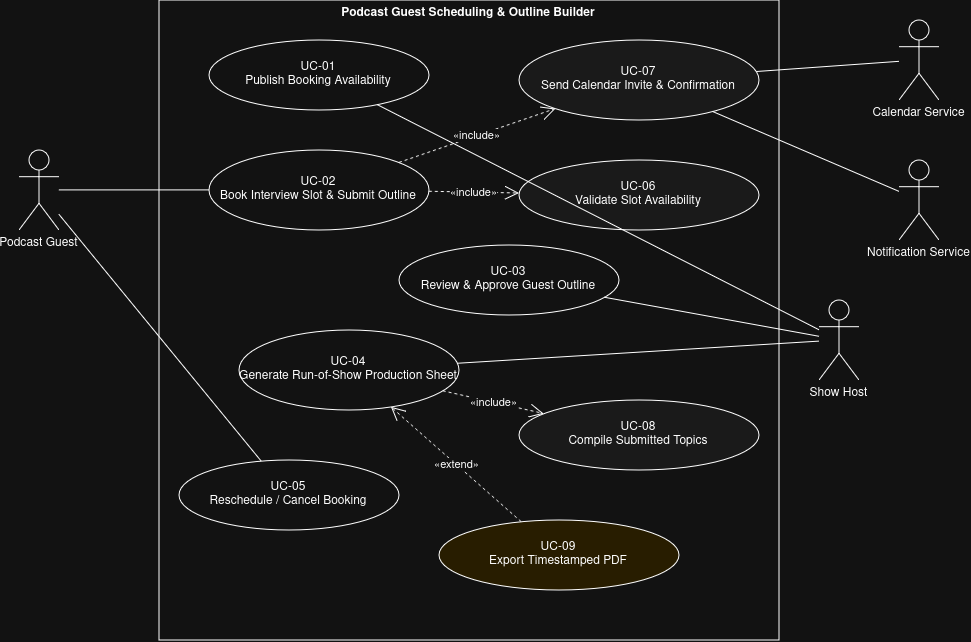

# Lab 1 - Requirements Engineering and UML Use-Case Modelling

**Problem Statement 60 - Podcast Guest Scheduling and Outline Builder**
(Domain: Media, Events and Community)

The idea is a media production organizer for podcasts. The host puts up the
slots they are free for, guests book one of those slots and send in the topics
they want to talk about, and the system turns those topics into a timestamped
run-of-show sheet the host can use while recording.

The problem statement gives two actors, Podcast Guest and Show Host. I added
the Calendar Service and the Notification Service because the requirements ask
for calendar invites and confirmation emails, and those are separate systems.

## Use-case diagram

## Actors

1. **Podcast Guest** - books a slot, sends in talking points, reschedules if needed
2. **Show Host** - publishes availability, reviews the outlines, builds the run-of-show
3. **Calendar Service** - supporting system, receives the invites
4. **Notification Service** - supporting system, sends the confirmation emails

## Use cases

| ID | Use case | Primary actor |
| --- | --- | --- |
| UC-01 | Publish Booking Availability | Show Host |
| UC-02 | Book Interview Slot and Submit Outline | Podcast Guest |
| UC-03 | Review and Approve Guest Outline | Show Host |
| UC-04 | Generate Run-of-Show Production Sheet | Show Host |
| UC-05 | Reschedule or Cancel Booking | Podcast Guest |
| UC-06 | Validate Slot Availability | included |
| UC-07 | Send Calendar Invite and Confirmation | included |
| UC-08 | Compile Submitted Topics | included |
| UC-09 | Export Timestamped PDF | extension |

## Include and extend

- UC-02 **includes** UC-06, because a booking always has to check the slot is free first
- UC-02 **includes** UC-07, because a booking always sends the invite and the confirmation
- UC-04 **includes** UC-08, because the run-of-show is always built from the submitted topics
- UC-09 **extends** UC-04, because exporting the sheet as a PDF is optional

The three includes happen every single time the base use case runs, so they are
reuse. The extend is something the host may or may not do, which is why the
arrow points back at UC-04 and not the other way round.

## Why I picked UC-02 for the flow document

UC-02 is the use case the rest of the system depends on, and it is the only one
that touches both actors, both supporting systems and both include
relationships. It also had obvious things that can go wrong, so I had real
alternate flows to write about instead of making some up. The two I documented
are the slot getting booked by another guest while the first guest is still
filling in the form, and a biography link that is not a proper web address.