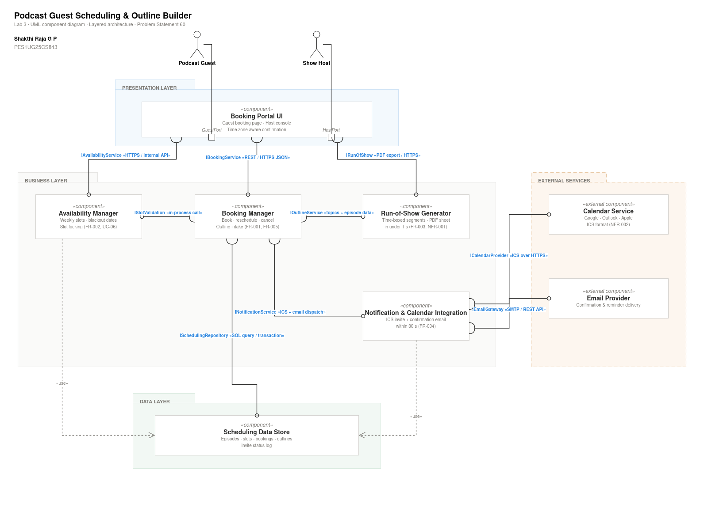

# Lab 3 - Architecture Selection and UML Component Modelling

**Problem Statement 60 - Podcast Guest Scheduling and Outline Builder**
(Domain: Media, Events and Community)

## Overview

- **Chosen Architecture:** Layered Architecture (Presentation Layer, Business Layer, Data Layer, External Services)
- **Key Drivers:** Clear separation of concerns, single-transaction slot validation to prevent double-booking, centralized authentication/security checks, and low operational complexity
- **Alternatives Evaluated:** Client-Server, Microservices

## Component Diagram

